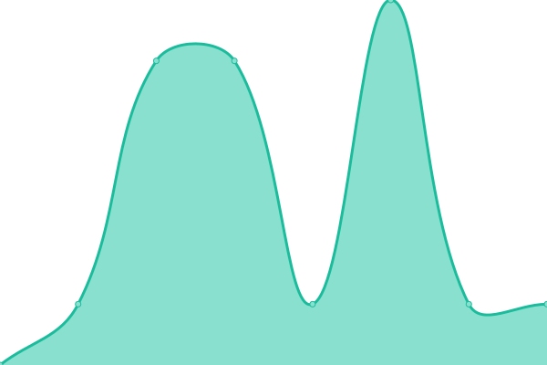
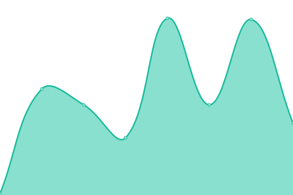
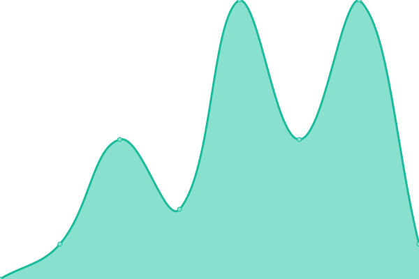
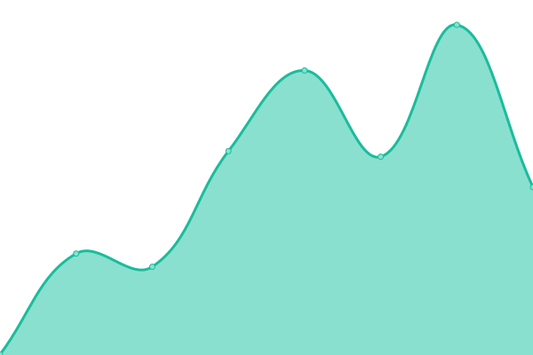
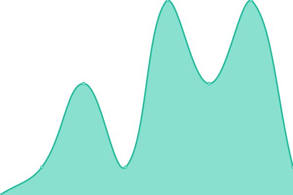

# [📈 Live Status](https://demo.upptime.js.org): <!--live status--> **🟩 All systems operational**

This repository contains the open-source uptime monitor and status page for [Upptime](https://upptime.js.org), powered by [Upptime](https://github.com/upptime/upptime).

With [Upptime](https://upptime.js.org), you can get your own unlimited and free uptime monitor and status page, powered entirely by a GitHub repository. We use [Issues](https://github.com/upptime/upptime/issues) as incident reports, [Actions](https://github.com/victorposada/vsh-upptime/actions) as uptime monitors, and [Pages](https://demo.upptime.js.org) for the status page.

<!--start: status pages-->
<!-- This summary is generated by Upptime (https://github.com/upptime/upptime) -->
<!-- Do not edit this manually, your changes will be overwritten -->
<!-- prettier-ignore -->
| URL | Status | History | Response Time | Uptime |
| --- | ------ | ------- | ------------- | ------ |
|  [Google](https://www.google.com) | 🟩 Up | [google.yml](https://github.com/victorposada/vsh-upptime/commits/HEAD/history/google.yml) | 

 109ms
     
 | 

<a href="https://victorposada.github.io/vsh-upptime/history/google">100.00%</a>
    

|  [Google DNS](8.8.8.8) | 🟩 Up | [google-dns.yml](https://github.com/victorposada/vsh-upptime/commits/HEAD/history/google-dns.yml) | 

 4ms
     
 | 

<a href="https://victorposada.github.io/vsh-upptime/history/google-dns">100.00%</a>
    

|  [Cludflare](https://www.cloudflare.com) | 🟩 Up | [cludflare.yml](https://github.com/victorposada/vsh-upptime/commits/HEAD/history/cludflare.yml) | 

 95ms
     
 | 

<a href="https://victorposada.github.io/vsh-upptime/history/cludflare">100.00%</a>
    

|  [Cloudflare DNS](1.1.1.1) | 🟩 Up | [cloudflare-dns.yml](https://github.com/victorposada/vsh-upptime/commits/HEAD/history/cloudflare-dns.yml) | 

 5ms
     
 | 

<a href="https://victorposada.github.io/vsh-upptime/history/cloudflare-dns">100.00%</a>
    

|  [Cisco](https://www.cisco.com) | 🟩 Up | [cisco.yml](https://github.com/victorposada/vsh-upptime/commits/HEAD/history/cisco.yml) | 

 556ms
     
 | 

<a href="https://victorposada.github.io/vsh-upptime/history/cisco">100.00%</a>
    

|  [Cisco DNS](208.67.222.222) | 🟩 Up | [cisco-dns.yml](https://github.com/victorposada/vsh-upptime/commits/HEAD/history/cisco-dns.yml) | 

 5ms
     
 | 

<a href="https://victorposada.github.io/vsh-upptime/history/cisco-dns">100.00%</a>
    

<!--end: status pages-->

[**Visit our status website →**](https://demo.upptime.js.org)

## 📄 License

- Powered by: [Upptime](https://github.com/upptime/upptime)
- Code: [MIT](./LICENSE) © [Upptime](https://upptime.js.org)
- Data in the `./history` directory: [Open Database License](https://opendatacommons.org/licenses/odbl/1-0/)
